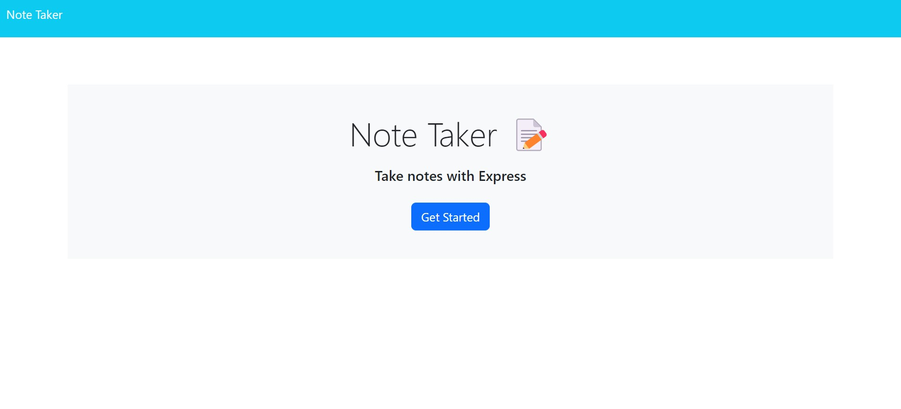

# Note-Taker

## Description
This project was created to allow the user to add, save and delete notes. This app used both front end and back end (Express,js).   

## Table of Contents

- [Description](#Description)
- [Usage](#Usage)
- [Credits](#Credits)
- [License](#license)

## Usage
When the user opens the page in their default browser they are presented with a page and a button "Get Started". Once that is clicked they are taken to the notes page where they can add and save their notes.  

https://note-taking01.herokuapp.com/

## Credits 

https://www.geeksforgeeks.org/express-js-express-urlencoded-function/

https://www.geeksforgeeks.org/express-js-app-delete-function/

https://www.tutorialspoint.com/express-js-app-delete-method

## License 

MIT License

Copyright (c) 2022 liliaungurean

Permission is hereby granted, free of charge, to any person obtaining a copy
of this software and associated documentation files (the "Software"), to deal
in the Software without restriction, including without limitation the rights
to use, copy, modify, merge, publish, distribute, sublicense, and/or sell
copies of the Software, and to permit persons to whom the Software is
furnished to do so, subject to the following conditions:

The above copyright notice and this permission notice shall be included in all
copies or substantial portions of the Software.

THE SOFTWARE IS PROVIDED "AS IS", WITHOUT WARRANTY OF ANY KIND, EXPRESS OR
IMPLIED, INCLUDING BUT NOT LIMITED TO THE WARRANTIES OF MERCHANTABILITY,
FITNESS FOR A PARTICULAR PURPOSE AND NONINFRINGEMENT. IN NO EVENT SHALL THE
AUTHORS OR COPYRIGHT HOLDERS BE LIABLE FOR ANY CLAIM, DAMAGES OR OTHER
LIABILITY, WHETHER IN AN ACTION OF CONTRACT, TORT OR OTHERWISE, ARISING FROM,
OUT OF OR IN CONNECTION WITH THE SOFTWARE OR THE USE OR OTHER DEALINGS IN THE
SOFTWARE.